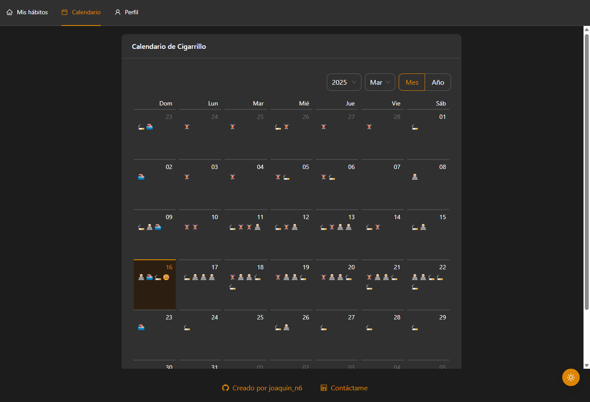
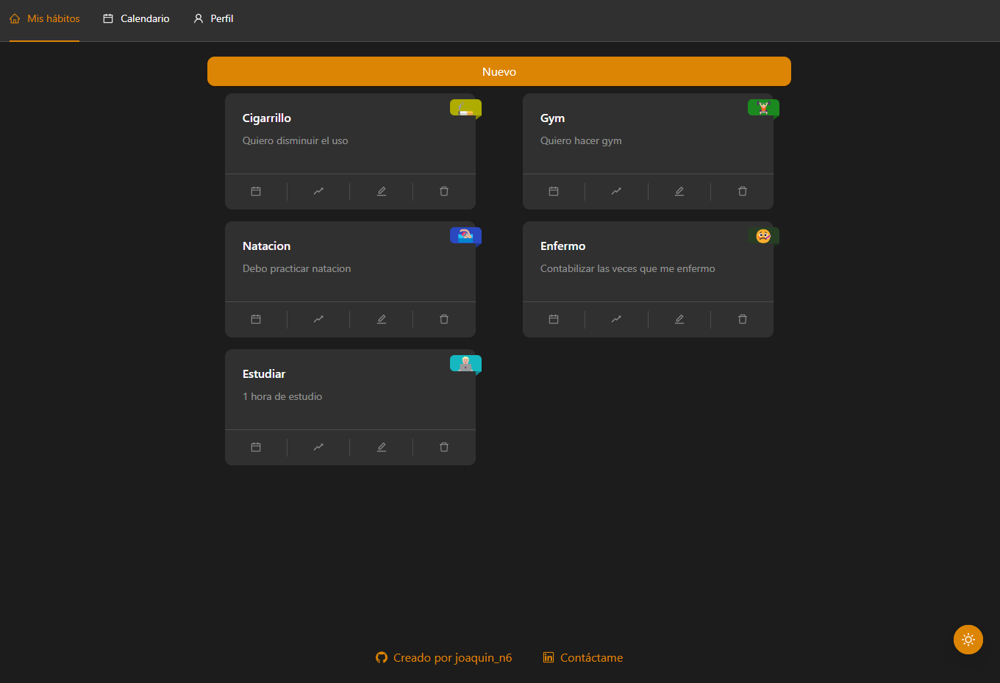

# 🌟 Control de hábitos | Habits control

🚀 _Un proyecto interactivo con diseño responsivo y habilitado para ser instalado en dispositivos mobiles._
🚀 _An interactive project with responsive design and enabled to be installed on mobile devices._

📌 **Enlace a la demo | Live demo link:** [🔗 Ver en Vivo | View Live](https://habits-three-iota.vercel.app/home-page)

---

## 🎯 Sobre este Proyecto | About this Project

### Español:

Este proyecto nació con el objetivo de aprender **React**, ya que llevo desde el 2020 trabajando en **Vue js** y quería explorar tecnologías diferentes, modernas, que me abrieran mas ventanas al mundo laboral, como lo es **React**.
Ademas de tener la necesidad de llevar un control de mis hábitos en mi vida cotidiana, para auto-analizarme y mejorar en el día a día.

_¡Este proyecto no es solo una carta de presentación, sino una muestra real de mis habilidades como desarrollador full-stack!_  

### English:

This project was born with the goal of learning **React**, because I have been working in **Vue js** since 2020 and wanted to explore different, modern technologies that would open more windows to the labor world, such as **React**.
In addition to having the need to keep track of my habits in my daily life, to self-analyze and improve day by day.

_This project is not just a presentation letter, but a real showcase of my skills as a full-stack developer!_  

---

## 🎥 Vista Previa | Preview 

📸 
📸 
📸 

---

## ✨ Características Principales | Key Features

### Español:
✅ Diseño moderno y responsivo con Ant Design.
✅ Modo claro/oscuro con personalización del tema. 
✅ Calendario interactivo con soporte para eventos y notas.
✅ Tour de usuario para pantalla de calendario.
✅ Consumo de api con axios.

### English:
✅ Modern and responsive design with Ant Design.
✅ Light/dark mode with theme customization.
✅ Interactive calendar with support for events and notes.
✅ User tour for calendar screen.
✅ API consumption with axios.

---

## 🛠 Tecnologías Utilizadas | Technologies Used

#### **Frontend:**
- React + Vite  
- Zustand (gestión de estado global | state Management)  
- Ant Design (UI)
- React Router (navegación | navigation)
- Dayjs (control de fechas | date control)
- Runes2 (control de emojis | emoji control)

### **Backend:**
- FastAPI ([🔗 Ver repositorio](https://https://github.com/joaquinn6/habits-api)) 
- MongoDB  

### **Despliegue | Deployment:**
- **Frontend:** Vercel  
- **Backend:** Render  

---

## 📬 Contacto | Contact

- **📧 Email:** joaquin.software.e@gmail.com  
- **💼 LinkedIn:** [Mi LinkedIn](https://www.linkedin.com/in/joaquin-n6/)  
- **🐙 GitHub:** [Mi GitHub](https://github.com/joaquinn6)  

---

## 📜 Licencia | License 
### Español:  
📄 Este proyecto está bajo la licencia **MIT**. Siéntete libre de usarlo, modificarlo y compartirlo.  

### English:  
This project is licensed under the **MIT** license. Feel free to use, modify, and share.  
