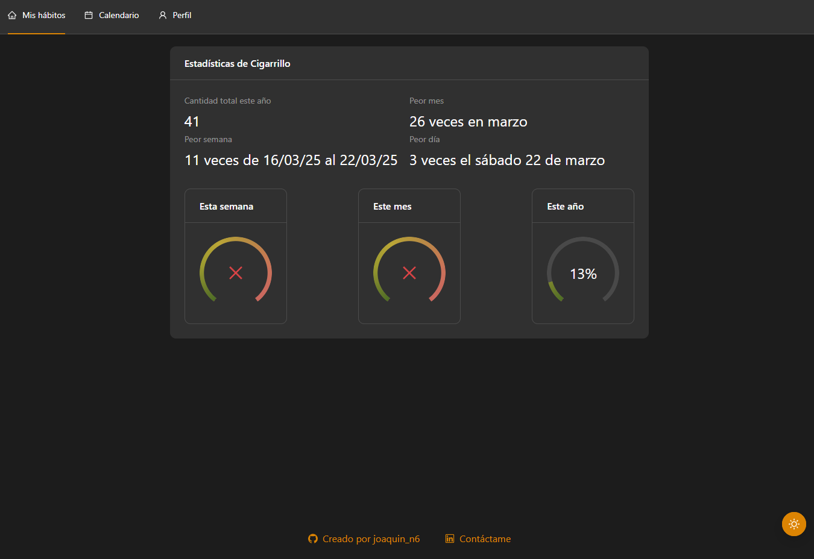

# 🌟 Control de hábitos

🚀 _Un portafolio interactivo con diseño responsivo y habilitado para ser instalado en dispositivos mobiles._

📌 **Enlace a la demo:** [🔗 Ver en Vivo](https://habits-three-iota.vercel.app/home-page)

---

## 🎯 Sobre este Proyecto

Este proyecto nació con el objetivo de aprender **React**, ya que llevo desde el 2020 trabajando en **Vue js** y quería explorar tecnologías diferentes, modernas, que me abrieran mas ventanas al mundo laboral, como lo es **React**.
Ademas de tener la necesidad de llevar un control de mis hábitos en mi vida cotidiana, para auto-analizarme y mejorar en el día a día

_¡Este portafolio no es solo una carta de presentación, sino una muestra real de mis habilidades como desarrollador full-stack!_  

---

## 🎥 Vista Previa

_Añade aquí capturas de pantalla o GIFs de tu portafolio_

📸 
📸 
📸 

---

## ✨ Características Principales

✅ Diseño moderno y responsivo con Ant Design.  
✅ Modo claro/oscuro con personalización del tema. 
✅ Calendario interactivo con soporte para eventos y notas.
✅ Tour de usuario para pantalla de calendario.
✅ Consumo de api con axios.

---

## 🛠 Tecnologías Utilizadas

### **Frontend:**
- React + Vite  
- Zustand (gestión de estado global)  
- Ant Design (UI)
- React Router (navegación)
- Dayjs (control de fechas)
- Runes2 (control de emojis)

### **Backend:**
- FastAPI ([🔗 Ver repositorio](https://https://github.com/joaquinn6/habits-api)) 
- MongoDB  

### **Despliegue:**
- **Frontend:** Vercel  
- **Backend:** Render  

---

## 📬 Contacto

Si quieres hablar conmigo o ver más de mi trabajo, puedes encontrarme en:

- **📧 Email:** joaquin.software.e@gmail.com  
- **💼 LinkedIn:** [Mi LinkedIn](https://www.linkedin.com/in/joaquin-n6/)  
- **🐙 GitHub:** [Mi GitHub](https://github.com/joaquinn6)  

---

## 📜 Licencia

📄 Este proyecto está bajo la licencia **MIT**. Siéntete libre de usarlo, modificarlo y compartirlo.  